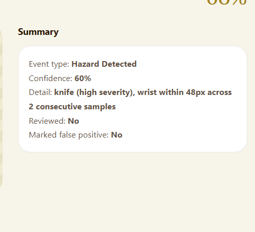

# Fight Detection System
   

> AI-powered real-time violence detection for mental hospitals and elder care facilities. Watches camera feeds, flags physical altercations as they escalate, and gets the right caregiver there before it becomes an emergency.

---

## Why is it needed

A night-shift caregiver in a memory-care wing might be covering two or three zones alone. They can't watch every hallway at once, and by the time a resident-on-resident altercation is loud enough to hear from another room, it's already been going on for a while. Static motion-detection cameras don't help either: they fire on every passing shadow and get ignored within a week.

This system watches the actual behavior: it detects people, classifies whether their interaction looks violent, tracks how that classification evolves per person over time, and only escalates to a caregiver once a real pattern (not one noisy frame) is confirmed. It records the clip, emails the right person, and logs the incident so it's reviewable later. That's the same discipline a monitoring system applies to any safety-critical alert, applied here to a physical space instead of a network.

---

## Who it's for

- **Caregivers and shift leads** at elder-care or mental-health facilities who need one dashboard for live camera status, active alerts, and incident history instead of watching a wall of feeds.
- **Facility administrators** who need to tune detection thresholds and swap the underlying model without shipping a new build.
- **Anyone building a camera-based safety system** who wants a reference implementation of a gated, per-person state machine instead of "alert on every frame over a threshold."

---

## Architecture

```
┌─────────────────────────────────────────────────────────┐
│                 Camera (webcam / RTSP)                  │
└───────────────────────┬─────────────────────────────────┘
                         │  raw frame, ~15 FPS
                         ▼
┌─────────────────────────────────────────────────────────┐
│              Person Detection (YOLO11n + tracker)        │
└───────────────────────┬─────────────────────────────────┘
                         ▼
┌─────────────────────────────────────────────────────────┐
│     Optical Flow Motion Gate: skips static scenes         │
│     so an empty, still hallway never reaches the model    │
└───────────────────────┬─────────────────────────────────┘
                         ▼
┌─────────────────────────────────────────────────────────┐
│      Violence Classifier (EfficientNet-B0), per person    │
└───────────────────────┬─────────────────────────────────┘
                         ▼
┌─────────────────────────────────────────────────────────┐
│   Per-Person State Machine (independent per tracked ID)   │
│   Normal → Proximate → Agitated → Fighting → On Ground     │
│                              → Emergency (30s motionless)  │
└───────────────────────┬─────────────────────────────────┘
                         │
                         │   Two independent, non-ML signals run
                         │   alongside the state machine above, not
                         │   inside it -- see "Detection Signals":
                         │     • Fall detection (bbox-collapse rule)
                         │     • Hazard detection (object near a wrist)
                         ▼
┌─────────────────────────────────────────────────────────┐
│   Confirmation Gate: score sustained above threshold       │
│   for N seconds, cooldown respected                       │
└───────────────────────┬─────────────────────────────────┘
                         ▼
        ┌────────────────┼────────────────┐
        ▼                ▼                ▼
   Clip Recording    Email Alert     POST /api/events/add
  (pre + post buffer)  (Notifier)    (internal-key auth) ──┐
                                                            ▼
                                          ┌──────────────────────────────┐
                                          │   Flask Dashboard (app.py)   │
                                          │   caregiver login (Flask-    │
                                          │   Login), rate limiting,     │
                                          │   room-scoped + role-gated   │
                                          │   routes, retention cleanup  │
                                          └──────────────────────────────┘
                                                            │
                                                            ▼
                                          Dashboard, Incident history, Clip
                                          archive, Alerts (sound + desktop
                                          notification), Analytics, System
                                          settings, served to the browser
                                          -- optionally over HTTPS, see
                                          "What's the deployer's responsibility"
```

The diagram above is the per-frame pipeline for one camera. Running more than one camera doesn't duplicate it: `MultiCameraEngine` loads each ML model (person detector, violence classifier, hazard pose model) exactly once and, every cycle, batches that one model call across every camera's latest frame instead of looping through cameras one at a time. Only per-camera state -- the state machine, hazard debounce streaks, object tracker, motion baseline -- stays separate. See "Multi-Camera Architecture" below.

## Screenshots



Real screenshots live under `screenshots/` (tracked, unlike `images/` -- see the note in Project Structure), not the placeholder `images/login.png`-style paths this section used to reference. Only one is checked in so far; add more here as they're captured.

---

## Key Design Decisions

**Motion gating before classification, not instead of it.** Optical flow checks whether anything in the frame is moving before the frame ever reaches the violence classifier. A static hallway never generates a score, which is what keeps this from becoming another camera that cries wolf.

**Per-person state, not per-frame score.** Two people standing close together isn't a fight; a sustained high score from one specific tracked person is. Each tracked ID has its own six-state machine (`Normal → Proximate → Agitated → Fighting → On Ground → Emergency`), so a fight between two people doesn't get lost in an averaged frame score, and a person left motionless on the ground for 30 seconds escalates on its own even if the "fight" itself already ended.

**Confirmation gate before alerting, not a single-frame trigger.** A score has to stay above `VIOLENCE_THRESHOLD` for `CONFIRM_SECONDS` of sustained frames before an alert fires, with a per-camera cooldown afterward. This is the same tradeoff any alerting system makes: catch it fast, but don't page someone over one noisy frame.

**A motion/proximity backup signal, because the classifier alone can under-score a real fight.** Agitated → Fighting normally requires the score to clear `VIOLENCE_THRESHOLD` (0.9 by default) -- and getting there at all requires the score to first clear `STATE_AGITATED_SCORE` (0.4), with no lower bar anywhere in that chain. A genuinely violent but blurry or oddly-angled clip (motion blur, a camera angle the RLVS/SCVD/UCF-Crime training data doesn't represent well) can average well under 0.4 and never escalate at all -- no alert, and critically no saved clip, since `_start_recording` is only ever called from inside the alert-trigger blocks. `StateMachine._update_motion_fight_pair` adds a second, score-independent path: if two *proximate* tracked people are **both** moving fast relative to their own bounding-box size (`STATE_MOTION_FIGHT_INTENSITY`, diagonals/sec so it's scale-invariant regardless of distance from the camera), sustained for `STATE_MOTION_FIGHT_CONFIRM_SECONDS`, both escalate straight to Fighting regardless of what the classifier scored them. Requiring *both* tracks to be fast, not just one, is deliberate -- one person walking briskly past someone standing still is common and is not a fight. It mirrors the existing fall-detection rule's shape exactly: geometry-only, no dependency on the classifier, a brief-interruption tolerance (`STATE_MOTION_FIGHT_RECOVER_SECONDS`) so one still frame mid-scuffle doesn't discard progress. A track that escalated this way carries `motion_confirmed_fight = True`, which `pipeline.py` surfaces in the console log and the dispatched alert payload so an operator reading a low-confidence "Fighting Detected" alert can see it was motion-corroborated, not a classifier false read.

**Two guards on the motion signal, added after it produced a real false positive.** In production, a single caregiver just moving around alone -- no second person anywhere in frame -- had the live feed unblur and a clip get recorded. The likely mechanism: `_check_proximity` only checks bbox-center distance, so a person tracker's occasional glitch of briefly reporting one real body as two overlapping track ids (most likely to happen exactly while someone is moving quickly, which is also what this signal is watching for) looked indistinguishable from "two proximate people both moving fast." Two independent guards in `_update_motion_fight_pair` now close that gap: `STATE_MOTION_FIGHT_MAX_IOU` rejects a pair whose latest boxes overlap more than that fraction (a duplicate detection's box sits almost exactly where the original was; two real people essentially never overlap that much even mid-grapple), and `STATE_MOTION_FIGHT_MIN_TRACK_AGE_SECONDS` withholds judgment on any track younger than that (a duplicate-detection artifact is, by definition, a track id that just appeared). Neither guard discards the pair's sustained-motion progress when it trips -- it just withholds that frame's judgment, the same way `_update_fall` withholds judgment on a too-small bbox rather than resetting.

**Fall and hazard detection are independent signals, not new branches of the violence state machine.** A person who trips with no altercation never generates a violence score, so bolting fall detection onto the six-state machine above would mean it only ever fires downstream of violence. Instead, `fall_status` (bbox height collapse + sustained horizontal aspect) and hazard detection (a knife/scissors/fork class from the same YOLO pass, near a wrist via pose estimation) are separate, rule-based signals -- not trained classifiers, since there's no labelled fall or hazard dataset in this project -- that run in parallel and can fire regardless of what the violence state machine is doing. See "Detection Signals" below.

**Room-scoped access is default-deny, not default-allow.** A caregiver's `assigned_rooms` defaults to an empty list, meaning zero visibility until an admin explicitly grants a room -- not "sees everything unless restricted." Every room-gated route (camera feed, score, incidents, clips, analytics) returns a `404`, not a `403`, for a room a caregiver can't access, so the response itself doesn't confirm that camera or incident exists at all.

**A separate secret for the detection service, not the caregiver login.** The detection pipeline posts incidents to the dashboard over HTTP from a background process with no browser session, so it authenticates with its own shared key (`INTERNAL_API_KEY`), completely separate from caregiver login. If that key leaks, it can only write incidents, not read camera feeds or touch settings.

**Login errors are deliberately generic.** "Invalid email or password" either way. The login screen never confirms whether an email is a valid account, so it can't be used to enumerate caregiver accounts.

**Row-level scoping by session identity, not by client-supplied ID.** A caregiver's profile is always read and written using the logged-in session's ID (`current_user.id`), never an ID the client sends. The same rule applies anywhere per-caregiver data gets added later.

**Two roles, enforced server-side.** Only administrators can change the detection model or detection defaults (confirm seconds, motion threshold, buffer, cooldown). The dashboard hides those controls from caregiver accounts, but the actual enforcement is a `403` from the Flask route itself: the UI hiding a button is not a security boundary.

**Every alert type gets a clip, not just the ones the state machine happens to confirm first.** Violence and Hazard events started a clip recording from the beginning; Fighting, Fall, and Emergency escalations did not, so an incident that only ever crossed the state-machine's Fighting/Fall/Emergency signals (never the raw score threshold) showed "No clip" in Incident History even though something real had happened. All five alert types now call the same `_start_recording` path, gated only on `alert_active` so an in-progress recording is never interrupted or reset by a second event firing mid-clip.

**A camera that drops one frame should not go dark for the rest of the run.** Each camera's capture thread used to treat a single failed `cap.read()` -- which happens for mundane reasons, like a transient driver hiccup -- as fatal, breaking its read loop permanently with no further output and no way to recover short of restarting the whole process. It now retries with a short backoff, and after enough consecutive failures releases and reopens the underlying capture device, logging each state transition so a real dead camera is still visible in the console, not silently hidden behind an endless retry loop.

**Hazard debouncing tracks "something dangerous is near a wrist," not "this specific label is near a wrist."** The underlying object classifier's label for a knife vs. scissors can flicker frame to frame even when the same physical object is being held in the same place. Debouncing per-label meant that flicker could reset the streak before it ever reached `HAZARD_MIN_CONSECUTIVE`, so a real, sustained hazard could go unreported. The streak is tracked once per camera, keyed to "closest hazard-class candidate to any wrist" regardless of which label won that frame, so classification noise on an otherwise-consistent detection no longer defeats the debounce.

**The reported hazard label is a vote across the debounce window, not whichever sample happened to trigger it.** A caregiver reported an incident logged as "Scissors Detected" for an object that was visibly a knife. Root cause: `_fire_events` used to report the label of whatever single sample crossed `HAZARD_MIN_CONSECUTIVE`, so a real knife correctly read on most of the debounced samples but misread as scissors on the specific sample that happened to hit the threshold got logged and alerted under the wrong label -- a coin flip against debounce window length, unrelated to what the classifier actually saw most. `_fire_events` now tallies which label won each sample across the whole streak and reports the plurality; an exact tie (common at the default `HAZARD_MIN_CONSECUTIVE=2`, where one sample each way has no majority) breaks toward whichever label had the higher total confidence.

**Dashboard "Quick actions" are real actions, not decoration.** The three cards on the dashboard home page used to be static -- nothing happened on click. "Review open incidents" and "Camera health" now navigate to the page that actually shows that information (Incident History and System Settings, respectively). "Round check-in" now logs a real, timestamped check-in for the current caregiver via `/api/checkins/add`, row-scoped by session identity the same way `/api/profile` already was (see "Row-level scoping by session identity" above) -- never a client-supplied caregiver id -- and the card shows that caregiver's own last check-in time, read back via `/api/checkins/last`. An admin-only `/api/checkins` endpoint, surfaced as a "Round check-in history" card in System Settings, lists every caregiver's check-ins newest first -- accountability for whether rounds are actually happening, not just a personal reminder to the caregiver who taps it.

**Check-ins live in `events.db`, not a new JSON file.** `SqliteCheckinsStore` (`dashboard/events_store.py`) adds a `round_checkins` table to the same SQLite file `SqliteEventsStore` already uses, rather than a sixth flat-JSON store next to cameras/profiles/announcements/settings. Check-in write volume doesn't scale with camera count the way incident events' does -- it scales with caregiver headcount and shift cadence, a caregiver tapping one button a few times a shift -- so it didn't independently justify a SQLite migration on the same grounds incident events did (see "Incident history is SQLite, everything else stays flat JSON" below). It moved there anyway because one database file with two tables is less operational sprawl than a database file plus a growing pile of single-purpose JSON files, once a SQLite connection already exists in the process. Unlike `SqliteEventsStore`'s diff-based `mutate`/`mutate_if` (built for incident notes/review/false-positive edits after the fact), `SqliteCheckinsStore` is a plain `add`/`last_for`/`list_all` surface, since a check-in is never edited after it's logged.

**A saved clip's frame rate is measured, not assumed.** The clip writer used to always encode at `config.FPS` -- the camera's *configured* target rate -- regardless of how many frames were actually captured during the real recording window. Under `MultiCameraEngine`'s batched cycle, the real per-camera capture/append rate can fall well short of `config.FPS` under load (more cameras, hazard pose detection enabled, a slow host); writing far fewer frames than `config.FPS` implies, at `config.FPS`, produces a technically valid `.mp4` whose reported duration (`frame_count / fps`) is a small fraction of the real event -- for a short enough frame count, that rounds to "0:00" in most players even though a real multi-second event was captured. Each camera now tracks the real wall-clock time its frames were appended (`buffer_times`, alongside `buffer`), and `_save_clip` derives the writer's fps from the real elapsed span and frame count instead, falling back to `config.FPS` only when that span is missing or too small to trust.

**Incident history is SQLite; cameras/profiles/announcements/settings stay flat JSON.** Those four are low-volume and rarely written, so a single JSON file with a lock is the right amount of infrastructure for them. Incident events are the store written on every alert, per camera, and a single-file-rewrite-per-write design (read the whole file, mutate a Python list, write the whole file back) doesn't hold up as camera count and incident volume grow -- every additional camera means more writers serializing on the same lock, and every mutation still pays the cost of rewriting the entire incident history to change one row. `dashboard/events_store.py`'s `SqliteEventsStore` is a drop-in replacement with the identical `load`/`save`/`mutate`/`mutate_if` interface `JsonStore` already had, so no route in `app.py` needed to change, but a mutation now does a real per-row `INSERT`/`UPDATE`/`DELETE` against an indexed table instead of a full-file rewrite. An existing `events.json` is migrated automatically and exactly once, the first time the app actually touches incident storage after upgrading: every event in it is imported into the new `events.db`, and the original file is renamed to `events.json.migrated` (kept, not deleted) rather than removed, so nothing is destroyed if a migration ever needs to be checked by hand.

---

## Security

### Caregiver authentication

There is no open sign-up route anywhere in the app. The very first account (an admin) is created from the command line (`auth/create_caregiver.py`). Every account after that is provisioned by an admin issuing a one-time invite from the dashboard's System Settings page, not by a visitor filling out a public form. An invite is a long random token, valid for 7 days, single-use, and tied to one email and role; the `/signup` route only renders a working form when a valid, unused, unexpired token is present in the link, and the token is consumed atomically the moment the account is created so two people can't race the same link. Passwords are hashed with Werkzeug's PBKDF2-based hasher: plaintext passwords are never stored, and `verify_caregiver()` runs a dummy hash comparison even when the email doesn't exist, so a nonexistent account doesn't respond measurably faster than a wrong password.

### Rate limiting

Login is rate-limited to 10 attempts per minute per IP via Flask-Limiter, enough for a caregiver who fat-fingers a password twice, not enough for a sustained brute-force run. The `/signup` route carries the same 10-per-minute limit, and invite creation is capped at 20 per minute per admin so a compromised admin session can't be used to spray invites. The test-alert endpoint (which sends real email) is limited to 5 per minute so it can't be used to spam a facility's inbox or run up an SMTP bill. Every other route falls under a 200-per-minute default. Rate-limit state is in-memory, which is correct for the single-process deployment this ships as. If this is ever run behind multiple worker processes, point `storage_uri` at a shared Redis instance instead; otherwise each worker enforces its own separate limit and an attacker gets more attempts than intended just by landing on a different one.

### Internal service authentication

`/api/events/add` (the endpoint the detection pipeline posts incidents to) is not behind caregiver login at all, because the pipeline has no browser session to log in with. It's gated by a separate shared secret (`X-Internal-Key` header, checked with `hmac.compare_digest` to avoid timing attacks) and fails closed with a `503` if that key isn't configured, rather than silently accepting unauthenticated writes.

That POST (and the follow-up "clip ready" POST once a recording finishes saving) is made with Python's `requests`, which verifies the server's TLS certificate against the public CA bundle by default. A self-signed cert -- which is what `src/certs/generate_cert.py` produces, see "What's the deployer's responsibility" below -- can never pass that check, so once the dashboard is served over HTTPS with that cert, every internal alert POST failed its SSL handshake silently: the alert printed to the console and the email attempted to send, but the incident never once reached Incident History, with nothing logged to explain why. `main.py` now threads the exact cert path it generated TLS from down into each camera's config as `DASHBOARD_CERT_PATH`, and the pipeline passes that specific cert to `requests`' `verify` argument instead of the public CA bundle -- trusting precisely the cert the dashboard is actually serving, not disabling verification wholesale. A failure here is also now printed instead of swallowed by a bare `except: pass`, so a real problem (wrong cert path, dashboard down, network issue) is visible in the console rather than silently invisible in the UI.

### CORS

No CORS package is used anywhere in this project. The dashboard is same-origin only, and no route should ever emit `Access-Control-Allow-Origin: *`. An `after_request` hook strips that header if it's ever present, as a backstop against a future change (a proxy, a copy-pasted snippet) reintroducing it.

### Role-based access control

Model uploads and detection-default edits require an `admin` role, checked in Flask via an `admin_required` decorator on the route itself: a caregiver session hitting those endpoints directly gets a `403`, regardless of what the frontend shows.

### Room-scoped access control

A caregiver's `Caregiver.assigned_rooms` defaults to an empty list -- deliberately "sees nothing" rather than "sees everything." `can_access_room(room)` is checked server-side on every room-relevant route: camera feed (`/video_feed/<id>`), live score, incidents and their notes/review/false-positive actions, clip listing and serving, and analytics. An inaccessible resource returns `404`, not `403`, so the response itself never confirms that a camera, incident, or clip exists in a room the caller can't see. Admins bypass the check entirely and always see every room. Clips are matched to a room by parsing the camera id out of the clip filename (`alert_<cam>_<timestamp>.mp4`); a filename that doesn't parse, or references a camera id no longer in `cameras.json`, is denied rather than guessed at.

### Data retention

Two independent age windows, configurable from System Settings: `retention_days` (default 90) for any incident record or clip file, and a shorter `false_positive_retention_days` (default 7) for incidents already marked as confirmed noise. A daily background thread (plus an admin-triggered "run cleanup now" button) deletes incident records and clip files older than their respective window. One deliberate limitation, stated directly in `dashboard/retention.py` and in the System Settings UI: clip files are deleted purely by file age, not cross-referenced to which incident they belong to, because that link is already unreliable elsewhere in this codebase (a clip's real path arrives as a separate "Clip Ready" event that never retroactively updates the original incident record). So marking an incident false-positive removes its *record* sooner, but the underlying clip video still ages out on the general `retention_days` window, not the shorter one -- lower the general window if getting confirmed-noise video off disk quickly matters more than incident history length.

### Model file loading

`torch.load()` on `.pt` model files is a pickle deserialization operation by default, which can execute arbitrary code if the file is malicious. Model upload is admin-only, but "admin-only" isn't the same as "no untrusted file ever reaches this path": the model is now loaded with `weights_only=True`, which restricts unpickling to tensors and plain data rather than arbitrary Python objects.

### Session secret and internal key

`SECRET_KEY` (signs caregiver sessions) and `INTERNAL_API_KEY` (authenticates the detection service) must each be a real random value set via the `HAVEN_SECRET_KEY`/`HAVEN_INTERNAL_API_KEY` environment variables (see step 4 above) -- not hardcoded in `config.py`, gitignored or not. If neither is set, the app falls back to a random key generated per process start: sessions won't survive a restart, which is the safe failure mode, not a silent security hole.

### What's the deployer's responsibility

`src/main.py` will terminate TLS itself if a cert/key pair exists at `src/certs/cert.pem` / `key.pem` (see `src/certs/generate_cert.py`), which is enough to unblock browser secure-context features on a facility's local network. That is not the same as production-grade TLS: it's a self-signed cert, so every browser shows a trust warning on first connect, and there's no chain to a public certificate authority. Running this anywhere reachable outside a trusted local network requires putting it behind a reverse proxy or load balancer with a real, publicly-trusted certificate (or a private network like Tailscale) instead -- see `src/certs/README.md` for why the self-signed option specifically should not be used for that case.

---

## Threat Model

**What this protects against**

- *Caregiver credential stuffing / brute force*: rate-limited login (10/min/IP), generic error messages that don't confirm account existence, hashed passwords.
- *Unauthenticated dashboard/API access*: every route requires a valid caregiver session; API routes return a clean `401` instead of an HTML redirect.
- *Privilege escalation from caregiver to admin-only actions*: enforced server-side per route, not just hidden in the UI.
- *A caregiver reaching a room they aren't assigned to*: default-deny `assigned_rooms`, server-side room checks on every room-relevant route, `404` instead of `403` so the response doesn't confirm the resource exists.
- *Confirmed-noise incidents and old footage accumulating indefinitely*: age-based retention with a shorter window for false positives (see "Data retention" above, including its one documented limitation).
- *Spoofed incident ingestion*: `/api/events/add` requires the internal shared key; without it, the endpoint fails closed rather than accepting anonymous writes.
- *CORS-based data exfiltration*: no wildcard CORS header is ever sent, with a runtime backstop that strips one if it appears.
- *Malicious model file execution*: `weights_only=True` on model loading blocks arbitrary code execution via a crafted `.pt` file.
- *Alert-channel abuse*: the test-alert endpoint is rate-limited so it can't be used to spam recipients or run up email costs.

**What this explicitly does not protect against**

- *A leaked `INTERNAL_API_KEY`*: anyone holding it can write fabricated incidents. There's no key rotation built in; rotating means setting a new `HAVEN_INTERNAL_API_KEY` value and restarting both the dashboard and every camera worker.
- *Network-level access to the server*: this app assumes it's deployed on a network the facility already controls. It can optionally terminate TLS itself with a self-signed cert (`src/certs/`), enough to satisfy browser secure-context checks on that local network, but it provides no VPN, network segmentation, or publicly-trusted certificate -- see "What's the deployer's responsibility" above.
- *A compromised admin account*: an admin who gets phished can change detection thresholds or swap the model. There's no second admin approval step, including for issuing new invites.
- *Distributed rate-limit bypass*: the in-memory limiter is per-process; running multiple app instances behind a load balancer without a shared Redis backend would let an attacker get more attempts by hitting different instances.
- *A camera worker thread that keeps capturing after its camera is deleted*: deleting a camera immediately unregisters it from every dashboard route (feed, score, `liveStatus`), so nothing new can read from it through the app -- but `CameraWorker` has no stop/join mechanism, so the underlying capture thread itself keeps running until the process restarts.

**What would be added in a production hardening pass**

- Move rate-limit storage to Redis for any multi-instance deployment.
- `INTERNAL_API_KEY` rotation with an overlap window so camera workers don't all need restarting in the same instant.
- An audit log of admin actions (model swaps, threshold changes), separate from the incident log.
- An access audit log (who viewed which feed/clip/incident), separate from both logs above.
- A real stop/join mechanism for `CameraWorker`, so deleting a camera actually releases its capture resource instead of just cutting off the dashboard's access to it.

---

## Stack

| Component | Technology |
|---|---|
| Detection | PyTorch, EfficientNet-B0 (violence classifier) |
| Person detection + tracking | Ultralytics YOLO11n, BoT-SORT |
| Motion gating | OpenCV optical flow (Farneback) |
| Backend | Flask 3.1 |
| Auth | Flask-Login, Werkzeug password hashing |
| Rate limiting | Flask-Limiter |
| Frontend | Vanilla JS + Jinja2 templates (no framework) |
| Fonts | Bitter (display), Figtree (body), via Google Fonts |
| Storage | SQLite (`outputs/logs/events.db`: incident events + round check-ins, two tables); flat JSON for everything else (cameras, profiles, settings, announcements) under `outputs/logs/` |
| Testing | pytest |

---

## Quick Start

### 1. Clone
```bash
git clone https://github.com/naziaperwaiz-ai/Fight-Detection.git
cd Fight-Detection
```

### 2. Install dependencies
```bash
pip install torch torchvision ultralytics opencv-python flask flask-login flask-limiter flask-wtf scikit-learn pandas requests
```

### 3. Download the model
Download `finetuned_model.pt` from Google Drive and place it in `models/`:

**[Download Models from Google Drive](https://drive.google.com/drive/folders/1NG1qVZZ-JG_2WDhVJ5vqSXZbGCuk91Qq?usp=sharing)**

### 4. Configure
```bash
cp src/detection/config.example.py src/detection/config.py
```

`config.py`'s non-secret defaults (`MODEL_PATH`, `CAMERA_SOURCE`, etc.) can be edited directly in the file. Secrets are read from environment variables instead of being written into the file at all, so set these before running the app:
```bash
export HAVEN_EMAIL_SENDER="your@gmail.com"
export HAVEN_EMAIL_APP_PASSWORD="your-app-password"
export HAVEN_EMAIL_RECIPIENTS="staff@hospital.com,other-staff@hospital.com"
export HAVEN_SECRET_KEY=$(python -c "import secrets; print(secrets.token_hex(32))")
export HAVEN_INTERNAL_API_KEY=$(python -c "import secrets; print(secrets.token_hex(32))")
```

`HAVEN_SECRET_KEY` and `HAVEN_INTERNAL_API_KEY` must each be your own randomly generated value, and never the same as each other. If either is left unset, the app still runs -- it generates a random value for that process only and prints a warning -- but sessions and the internal API key then reset on every restart, so set both explicitly for anything meant to stay up. Never commit `config.py` (it's already gitignored) or put real secret values in it; the whole point of reading them from the environment is that they never need to live in a file on disk next to the code.

### 5. Create your first account
There is no open sign-up page you can use before any account exists, so the very first account has to come from the command line. Make it an `admin`, since only admins can invite anyone else afterward.
```bash
cd src
python -m auth.create_caregiver --email lead@ward.org --name "Shift Lead" --role admin
```
You'll be prompted for a password (min. 8 characters) if you don't pass `--password`. To list or remove accounts:
```bash
python -m auth.create_caregiver --list
python -m auth.create_caregiver --delete jane@ward.org
```

**Inviting everyone else.** Once that admin account exists, sign in and open **System Settings → Team access**. Fill in a new caregiver or admin's email, name, and role, then click **Send invite**. The dashboard generates a one-time sign-up link, valid for 7 days, that you copy and send to that person however you'd normally reach them. They open the link, see their email pre-filled, and set their own password; the link stops working the moment they use it (or after 7 days, whichever comes first). Nobody can create an account without an admin issuing that link first, and admins can revoke a pending invite from the same panel if it was sent to the wrong person. The CLI (`auth/create_caregiver.py`) still works if you'd rather script account creation than use the UI.

### 6. (Optional) Generate a TLS cert
```bash
pip install cryptography
python src/certs/generate_cert.py
```
Without this, the dashboard serves plain HTTP and works fine for API calls, but browsers block "secure context" features -- currently the desktop notification toggle -- until it's served over HTTPS. See `src/certs/README.md`.

### 7. Run
```bash
py src/main.py
```

If a cert was generated in step 6, open **https://localhost:5000** -- your browser will show a "not private" warning the first time, since this is a self-signed cert, not one from a public CA; click through it once. Otherwise open **http://localhost:5000**. Sign in with an account you created above.

---

## Testing

```bash
pip install pytest
PYTHONPATH=src pytest tests/ -v
```

162 tests across 7 files, all passing:

`tests/test_dashboard.py` (63 tests) covers the Flask app end to end: login happy path and failure paths (wrong password, nonexistent email, both giving the same generic error), the login rate limit actually triggering a `429` after repeated attempts, the open-redirect guard on the post-login `next` parameter, session teardown on logout, the CORS-wildcard-stripping hook, admin-only enforcement on system settings and model upload (caregiver gets `403`, admin gets `200`), camera CRUD, internal-key enforcement on incident ingestion, incident notes/review/false-positive toggles, per-caregiver profile scoping (one caregiver's saved profile isn't visible as another's), round check-in logging and its same per-caregiver scoping, plus the admin-only check-in history endpoint (see "Quick actions are real actions" above), alert settings persistence (including the sound/desktop notification toggles), and analytics reflecting logged incidents. It also covers the invite flow specifically: a caregiver can't create invites (`403`), an admin-issued invite grants access to `/signup`, submitting it creates the account and logs the new user in, the same link is rejected as invalid on a second use, mismatched passwords are rejected without consuming the token, an invite can't target an email that already has an account, admins can revoke a pending invite, and repeated sign-up submissions trip the rate limiter. Room-scoped access gets its own block: an unassigned caregiver sees zero rooms, a scoped caregiver sees only their room across cameras/incidents/analytics/clips, cross-room video-feed/score/clip access is denied (including the deleted-camera edge case where a still-registered worker must not become reachable again), and only an admin can change a caregiver's room assignment. Retention gets its own block too: cleanup is admin-only, correctly deletes old and false-positive incidents on their respective windows, and the admin status endpoint reflects the last run. Each test runs against a throwaway store (SQLite events db plus the flat JSON stores), not real deployment data.

`tests/test_pipeline.py` (34 tests) covers `detection/pipeline.py`'s `process_frame()` alert-escalation and recording wiring: that Fighting/Fall/Emergency alerts dispatch (previously `has_fighting()` had zero callers anywhere in the codebase) and share one cooldown budget per camera rather than each getting its own; the live-feed privacy blur (frozen, pixelated placeholder except while something is actually happening -- Agitated and up, a confirmed fall, or a hazard event this frame -- with a hysteresis window before it re-blurs); hazard bounding-box visualization on the live feed; and clip recording for every alert type (Violence, Hazard, Fighting, Fall, Emergency all start a recording, an already-in-progress recording is never interrupted by a second event, and a clip is actually written to disk once `POST_EVENT_SECONDS` elapses). It also regression-tests `_dispatch_alert`'s and `_save_clip`'s SSL cert verification and error logging (see "Internal service authentication" above), and `_save_clip`'s writer fps (derived from the real achieved capture rate, floored at a valid positive value, falling back to `config.FPS` only when the real elapsed span is missing or too small to trust -- see "A saved clip's frame rate is measured, not assumed" above).

`tests/test_multi_camera.py` (22 tests) covers the batched multi-camera engine (`detection/multi_camera.py`) and what it depends on: `SimpleIOUTracker` (id persistence across frames, new ids for new boxes, aging out stale tracks, and that two cameras' trackers never see each other's ids) and `hazard._fire_events`'s debounce/streak firing, including that label flicker between samples (e.g. knife vs. scissors on the same physical object) doesn't defeat the streak, and that the reported label is the majority across the debounce window -- not just whichever sample happened to trigger it -- with ties breaking toward higher total confidence. It also covers `_CaptureThread`'s resilience to a single dropped frame (retries, doesn't break the read loop) and to sustained failure (reopens the underlying capture device after enough consecutive failures).

`tests/test_notifier.py` (10 tests) covers `notification/notifier.py`'s live-settings wiring (a caregiver's saved Alert Settings -- recipients, `email_channel` -- actually changes what a real alert does, not just what the test-alert endpoint uses) and the blank-credential handling: `send_alert` skips gracefully with a clear message when `EMAIL_SENDER`/`EMAIL_APP_PASSWORD` are blank instead of falling through to a raw SMTP auth error, and a genuine Gmail credential rejection (`535`) prints a specific pointer toward the two most common causes (not a Google App Password, or 2-Step Verification not enabled).

`tests/test_state_machine.py` (17 tests) unit-tests the per-person state machine and the fall-detection rule in `detection/state_machine.py` directly, with a monkeypatched clock instead of real sleeps: a sustained fall confirms, a single occluded/too-small sample mid-window doesn't discard progress toward confirmation, genuinely standing back up still resets to `None`, and a `Confirmed` track correctly recovers to `None` after sustained recovery time -- this is the only layer of the codebase that exercises the state machine directly rather than through the Flask HTTP layer. It also covers the motion/proximity backup signal (see "A motion/proximity backup signal" above): mutual fast motion between two proximate tracks escalates to Fighting even when the score never clears `STATE_AGITATED_SCORE`, a single fast mover next to someone stationary does not escalate, a brief stall doesn't discard sustained-motion progress while a stall past `STATE_MOTION_FIGHT_RECOVER_SECONDS` does reset it, `motion_confirmed_fight` is set on escalation and cleared once the track recovers back down the ladder, and -- the regression test for a real reported false positive -- two heavily-overlapping boxes (a simulated duplicate-detection glitch) never escalate no matter how long the shared motion continues, and a freshly-spawned second track can't co-trigger the signal before `STATE_MOTION_FIGHT_MIN_TRACK_AGE_SECONDS` has passed.

`tests/test_main.py` (13 tests) covers `src/main.py`'s `_build_camera_config`, the function that turns one `cameras.json` record into a per-camera `Config` used by `MultiCameraEngine` -- including that `DASHBOARD_CERT_PATH` is threaded through when TLS is configured and absent otherwise.

`tests/test_detector.py` (3 tests) regression-tests a rate-limited diagnostic in `PersonDetector.detect()` for a frame where the tracker returns no `ids` array (a real, expected occurrence, not a bug) -- it used to silently drop every person-class box with zero visibility into why.

---

## State Machine

Each tracked person moves through six states independently:

```
Normal ──► Proximate ──► Agitated ──► Fighting ──► On Ground ──► Emergency
  ▲                          │                                       │
  └──────────────────────────┘                              (30s motionless)
```

| State | Trigger | Color |
|---|---|---|
| Normal | Default | Green |
| Proximate | Two people close together | Yellow |
| Agitated | Rapid movement, score > 0.4 | Orange |
| Fighting | Score > 0.9 sustained, **or** two proximate people both moving fast (bbox-diagonals/sec) sustained `STATE_MOTION_FIGHT_CONFIRM_SECONDS` -- see "A motion/proximity backup signal" above | Red |
| On Ground | Bounding box wider than tall | Purple |
| Emergency | On ground > 30 seconds | Alert |

### Fall and hazard detection (independent signals)

Two more signals run alongside the state machine above, not as extra states inside it -- see "Fall and hazard detection are independent signals" in Key Design Decisions for why. Both are rule-based, not trained classifiers: there's no labelled fall or hazard dataset in this project, so `fall_status` and hazard detections are triage signals to review, not scored model output.

| Signal | States | Trigger | Config |
|---|---|---|---|
| Fall detection | `None` → `Suspected` → `Confirmed` (or back to `None`) | Bbox height collapses to `FALL_HEIGHT_DROP_RATIO` of its recent standing reference and stays wider-than-tall for `FALL_CONFIRM_SECONDS`; a brief occluded/too-small sample mid-window doesn't reset progress, but sustained recovery does | `FALL_HEIGHT_DROP_RATIO`, `FALL_LOOKBACK_SECONDS`, `FALL_CONFIRM_SECONDS`, `FALL_MIN_BBOX_HEIGHT` |
| Hazard detection | fires per sampled frame once `HAZARD_MIN_CONSECUTIVE` consecutive detections are seen | A COCO knife/scissors/fork-class object (detected in the same YOLO pass as person detection, at near-zero marginal cost) within `HAZARD_PROXIMITY_FRAC` of a pose-estimated wrist | `HAZARD_DETECTION_ENABLED`, `HAZARD_POSE_WEIGHTS`, `HAZARD_IMGSZ`, `HAZARD_SAMPLE_EVERY_N_FRAMES`, `HAZARD_PROXIMITY_FRAC`, `HAZARD_MIN_CONSECUTIVE`, `HAZARD_MIN_SEVERITY` |

Hazard detection is opt-in and disabled by default (`HAZARD_DETECTION_ENABLED = False`) since the pose-estimation pass has a real CPU cost on top of the existing detection + classification pipeline.

---

## Model Performance

| Metric | Score |
|---|---|
| Validation F1 | 0.8981 |
| ROC-AUC | 0.9343 |
| Validation Accuracy | 86.7% |

**Training datasets:** RLVS (Real Life Violence Situations, 2,000 clips), SCVD (Smart City CCTV Violence Detection), UCF-Crime (Fighting, Assault, Abuse, NormalVideos).

---

## Configuration Reference

| Parameter | Default | Description |
|---|---|---|
| `MODEL_PATH` | `models/finetuned_model.pt` | Swap model by changing this |
| `CAMERA_SOURCE` | `0` | Webcam index or RTSP URL |
| `VIOLENCE_THRESHOLD` | `0.90` | Alert trigger threshold |
| `CONFIRM_SECONDS` | `3` | Seconds of sustained detection before alert |
| `MOTION_THRESHOLD` | `1.5` | Optical flow threshold to skip static scenes |
| `BUFFER_SECONDS` | `10` | Pre-event recording buffer |
| `POST_EVENT_SECONDS` | `15` | Recording duration after alert |
| `COOLDOWN_SECONDS` | `120` | Minimum seconds between alerts per camera |
| `SECRET_KEY` | (none) | Signs caregiver sessions; generate your own |
| `INTERNAL_API_KEY` | (none) | Authenticates the detection service to the dashboard; generate your own |
| `FALL_HEIGHT_DROP_RATIO` | `0.5` | Bbox height collapse fraction that can start a Suspected fall |
| `FALL_LOOKBACK_SECONDS` | `2.0` | Window used to compute the "was standing" reference height |
| `FALL_CONFIRM_SECONDS` | `2.0` | Sustained collapsed+horizontal time before Suspected → Confirmed |
| `FALL_MIN_BBOX_HEIGHT` | `40` | Bboxes smaller than this can't be judged either way |
| `HAZARD_DETECTION_ENABLED` | `False` | Opt-in; adds a pose-estimation pass with a real CPU cost |
| `HAZARD_POSE_WEIGHTS` | `yolov8n-pose.pt` | Pose model used only for hazard's wrist-proximity check |
| `HAZARD_IMGSZ` | `320` | Inference resolution for the hazard pose pass |
| `HAZARD_SAMPLE_EVERY_N_FRAMES` | `5` | Throttles the pose pass; object detection still runs every frame |
| `HAZARD_PROXIMITY_FRAC` | `0.06` | Object-to-wrist distance threshold, as a fraction of frame size |
| `HAZARD_MIN_CONSECUTIVE` | `2` | Consecutive sampled detections required before a hazard fires |
| `HAZARD_MIN_SEVERITY` | `high` | Minimum severity class (see `hazard_class_map`) to act on |
| `HAZARD_BOX_DISPLAY_SECONDS` | `5` | How long a bounding box stays drawn on the live feed around a flagged hazard object |
| `DASHBOARD_CERT_PATH` | (none) | Not user-configured -- `main.py` sets this automatically from whatever TLS cert it generated, so internal alert/incident POSTs verify against that exact cert instead of the public CA bundle. See "Internal service authentication" above |

System Settings (dashboard, not `config.py`) also exposes `retention_days` (default `90`) and `false_positive_retention_days` (default `7`) -- see "Data retention" in the Security section.

Admins can also change `CONFIRM_SECONDS`, `MOTION_THRESHOLD`, `BUFFER_SECONDS`, and `POST_EVENT_SECONDS` from the System Settings page in the dashboard; caregivers see these as read-only. `main.py` reads these into each camera's `Config` at engine startup, so a saved change takes effect the next time the detection service (re)starts, not on already-running cameras -- restart to pick up a new value.

---

## Multi-Camera Architecture

`MultiCameraEngine` (`detection/multi_camera.py`) is what actually runs in production, not one `CameraWorker` per camera in isolation. It loads each ML model exactly once -- one shared person detector, one shared violence classifier, one shared hazard pose model -- and, once per cycle, batches that one model call across every camera's latest frame instead of looping through cameras and calling each model once per camera. A GPU (or CPU) processing N frames in one batched call is faster per-frame than N sequential single-frame calls, since the model's fixed overhead is paid once, not N times. Each camera still has its own lightweight capture thread that only does frame I/O -- reading off the video source -- so a slow or stalled camera doesn't stall the batch; per-camera state (state machine, hazard debounce streak, object tracker, motion baseline) also stays fully separate, only the model calls themselves are shared.

**Cycle timing.** The engine's cycle interval is `1 / max(FPS across all configured cameras)`, so the whole batched cycle targets running once per frame-period of the fastest camera. Adding cameras increases the amount of work done inside each cycle (more frames to detect, track, and pose-estimate) without increasing the time budget per cycle -- so the practical failure mode as camera count grows isn't a crash, it's cycles quietly falling behind and both detection and the live feed lagging real time. `_run_cycle` now logs a diagnostic (rate-limited to once per 5s, only when a cycle runs at least 3x its target) breaking the cycle down by step -- frame gather, detection, tracking/motion, classification, hazard pose, dispatch -- specifically so "the cycle is slow" becomes "the pose model took 12s of a 14s cycle" instead of a guess. A slow cycle isn't just a live-feed lag issue: it also means `process_frame()` runs far less often than `config.FPS` implies, which starves a saved clip's frame count relative to its recording window's real wall-clock length (see "A saved clip's frame rate is measured, not assumed" above) -- so on a heavily CPU-bound deployment, a clip can legitimately end up being very short even with that fix in place, because there genuinely weren't many frames captured during the window. Watch for this log line if clips seem shorter than `POST_EVENT_SECONDS` should produce.

**Device placement.** The violence classifier already picks CUDA when available (`torch.device("cuda" if torch.cuda.is_available() else "cpu")`) and falls back to CPU otherwise. The person detector and hazard pose model are currently hardcoded to `device="cpu"` regardless of what hardware is present, even though both are Ultralytics YOLO models whose `.track()`/`.predict()` calls already accept a `device` argument -- the plumbing to run them on GPU exists, it's just not wired up yet. At low camera counts this doesn't matter; as camera count grows, the CPU-bound batched detection and pose passes are the more likely first bottleneck, not the classifier, since they scale with camera count while the CPU's compute budget doesn't. Moving them onto the same device as the classifier is mechanical (pass the same device value through instead of the `"cpu"` literal) but should be validated under real camera count and real hardware afterward, since it introduces GPU memory contention between three models that didn't exist when only the classifier ran there.

---

## Project Structure

```
Fight-Detection/
├── src/
│   ├── main.py                       # Single entry point
│   ├── auth/
│   │   ├── users.py                  # Account store (hashed passwords, roles)
│   │   └── create_caregiver.py       # CLI, provisions the first admin account
│   ├── detection/
│   │   ├── pipeline.py               # Core inference pipeline (CameraWorker), alerting, clip recording
│   │   ├── multi_camera.py           # MultiCameraEngine: one shared model set, batched per cycle across cameras
│   │   ├── detector.py               # YOLO person detector + tracker (+ hazard's object pass)
│   │   ├── state_machine.py          # Per-person 6-state machine, plus independent fall_status
│   │   ├── hazard.py                 # Hazard detection: object-near-wrist rule (pose model)
│   │   ├── config.example.py         # Configuration template
│   │   └── config.py                 # Your config (not in repo)
│   ├── dashboard/
│   │   ├── app.py                    # Flask app: auth, room scoping, rate limiting, all API routes
│   │   ├── events_store.py           # SqliteEventsStore (incident events) + SqliteCheckinsStore (round check-ins), same events.db
│   │   ├── retention.py              # Age-based cleanup of old incidents/clips
│   │   ├── static/                   # CSS, JS, images
│   │   └── templates/                # login.html, index.html, signup.html
│   ├── notification/
│   │   └── notifier.py               # Email notification handler
│   └── certs/
│       ├── generate_cert.py          # Self-signed TLS cert for local/LAN HTTPS
│       └── README.md                 # When (not) to use a self-signed cert
├── tests/
│   ├── test_dashboard.py             # pytest suite for the Flask app
│   ├── test_pipeline.py              # Alert escalation, clip recording, live-feed blur
│   ├── test_multi_camera.py          # Batched engine, SimpleIOUTracker, hazard debounce, capture resilience
│   ├── test_notifier.py              # Live alert settings, blank-credential and Gmail-auth handling
│   ├── test_main.py                  # cameras.json -> per-camera Config mapping
│   ├── test_detector.py              # PersonDetector diagnostic logging
│   └── test_state_machine.py         # Direct unit tests for the per-person state machine + fall rule
├── outputs/
│   ├── clips/                        # Recorded alert clips
│   ├── logs/                         # events.db (SQLite), cameras.json, users.json, invites.json, etc.
│   └── manifests/                    # Dataset CSVs
├── models/                           # Model weights (see Drive link)
├── screenshots/                      # Real product screenshots for the README (tracked, unlike images/ below)
├── images/                           # Design-reference clippings, not product screenshots -- gitignored
└── README.md
```

---

## Alert Channels

Three channels, each independently toggleable from Alerts & Notifications. **Email**: two emails sent per event -- an immediate alert (camera ID, room, confidence score, timestamp), and a clip-ready follow-up with the video file attached. Set up a Gmail app password at [myaccount.google.com/apppasswords](https://myaccount.google.com/apppasswords). **Sound**: a short in-tab chime (Web Audio, no audio file) on any new, unresolved Violence/Fall/Hazard/Emergency event; unlocks on the first click anywhere in the dashboard, since browsers block audio before a user gesture. **Desktop notification**: a native OS toast via the Notification API while the dashboard tab is open, even backgrounded -- requires a secure context (HTTPS or `localhost`), so it depends on the TLS setup in "What's the deployer's responsibility"; the UI surfaces a warning when the browser is blocking it rather than failing silently.

---

## Roadmap

- [ ] AWS Kinesis Video Streams integration
- [ ] SageMaker serverless inference endpoint
- [ ] S3 clip storage with presigned URLs
- [ ] WhatsApp/SMS notifications
- [ ] Thermal IR camera support
- [ ] YOLO26 upgrade when available in Ultralytics
- [ ] Staged indoor clip retraining for hospital domain
- [ ] Shared Redis-backed rate limiting for multi-instance deployments
- [ ] Admin action audit log (model swaps, threshold changes)
- [ ] Access audit log (who viewed which live feed, clip, or incident, and when) -- separate from the admin action log above
- [ ] Blur video outside confirmed alerts (silhouette/blurred feed during normal operation, full video only once an alert fires)
- [ ] `INTERNAL_API_KEY` rotation with an overlap window, so camera workers don't all need restarting in the same instant
- [ ] A real stop/join mechanism for `CameraWorker` threads -- deleting a camera today unregisters it from the dashboard's routes immediately, but the underlying capture thread has no way to be told to stop
- [ ] Move the person detector and hazard pose model onto GPU (currently hardcoded to CPU; only the violence classifier already picks CUDA when available) -- see "Multi-Camera Architecture" above for why this is the more likely bottleneck as camera count grows

---

## Team

Built during summer internship for AI-powered institutional safety monitoring.
