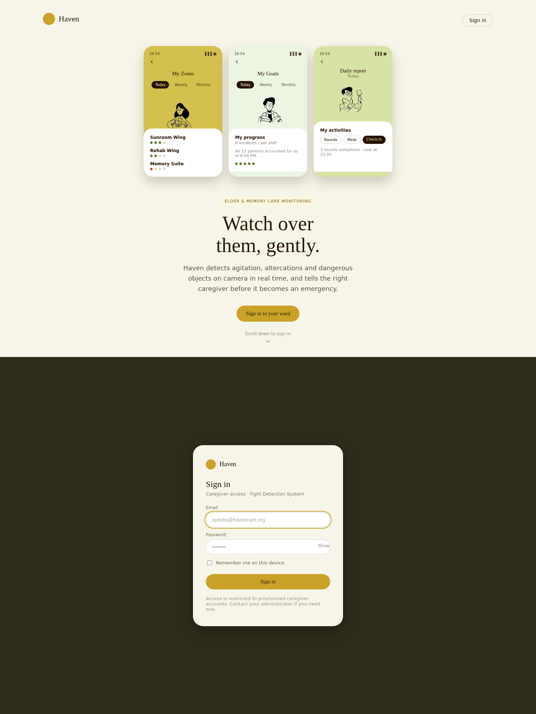
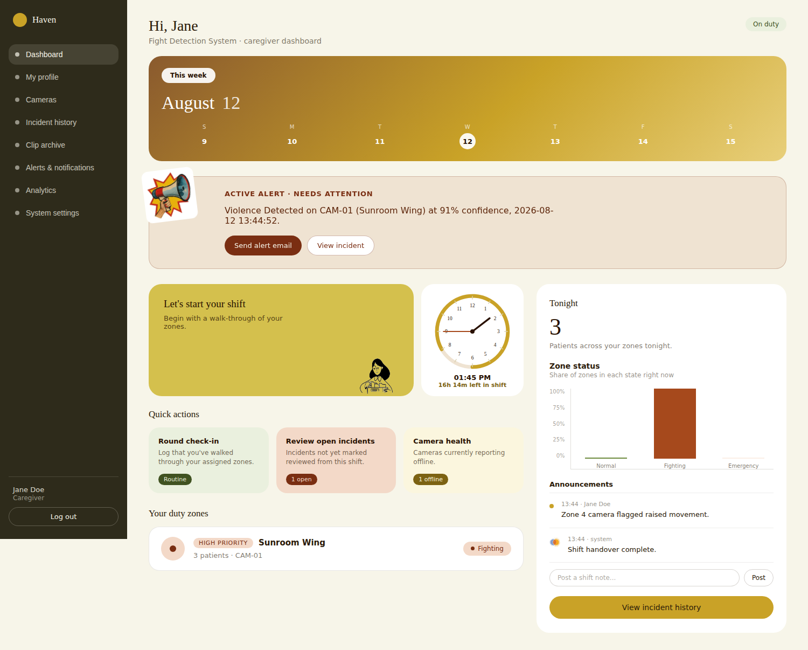
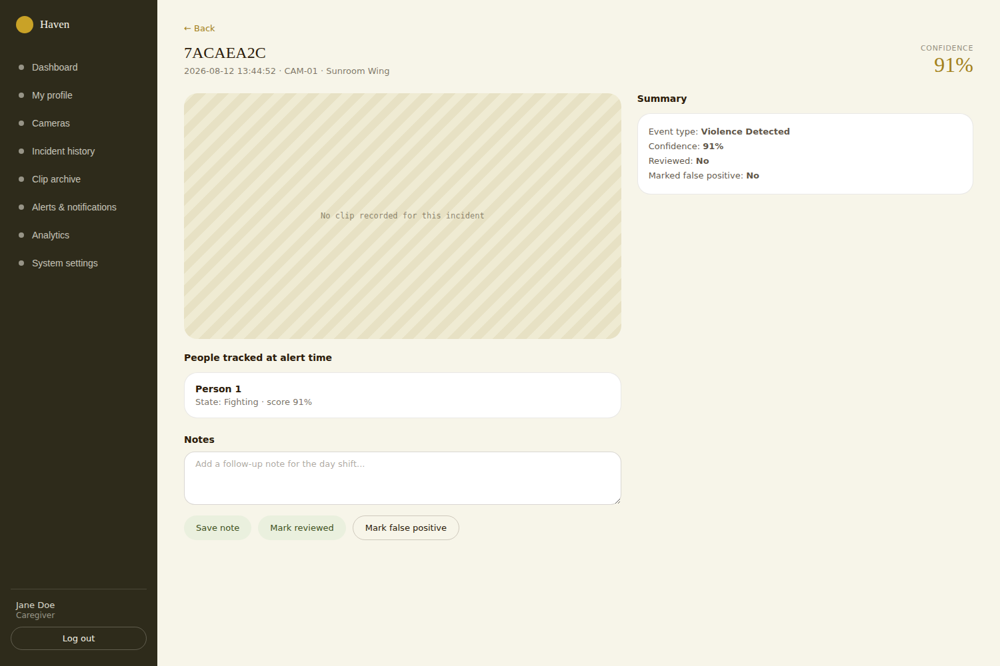
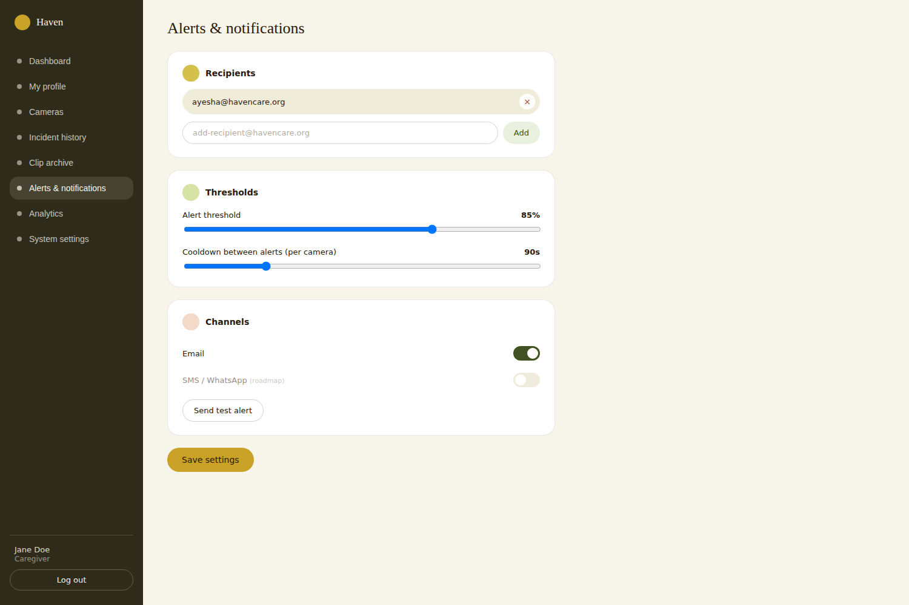
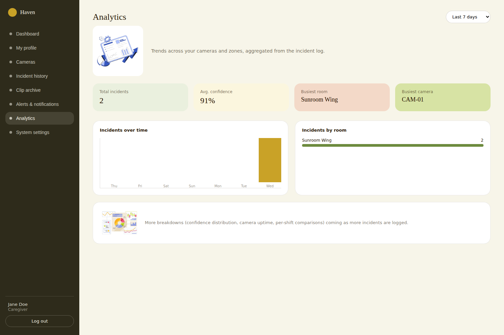
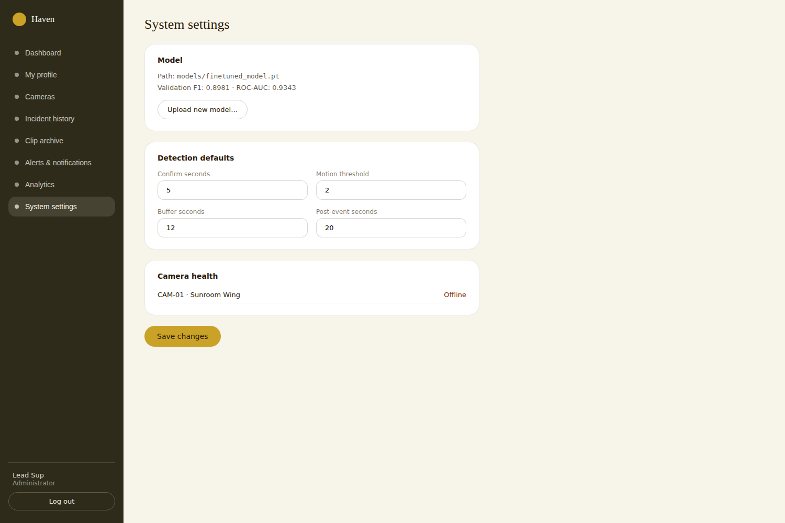

# Fight Detection System
   

> AI-powered real-time violence detection for mental hospitals and elder care facilities. Watches camera feeds, flags physical altercations as they escalate, and gets the right caregiver there before it becomes an emergency.

---

## Why is it needed

A night-shift caregiver in a memory-care wing might be covering two or three zones alone. They can't watch every hallway at once, and by the time a resident-on-resident altercation is loud enough to hear from another room, it's already been going on for a while. Static motion-detection cameras don't help either: they fire on every passing shadow and get ignored within a week.

This system watches the actual behavior: it detects people, classifies whether their interaction looks violent, tracks how that classification evolves per person over time, and only escalates to a caregiver once a real pattern (not one noisy frame) is confirmed. It records the clip, emails the right person, and logs the incident so it's reviewable later. That's the same discipline a monitoring system applies to any safety-critical alert, applied here to a physical space instead of a network.

---

## Who it's for

- **Caregivers and shift leads** at elder-care or mental-health facilities who need one dashboard for live camera status, active alerts, and incident history instead of watching a wall of feeds.
- **Facility administrators** who need to tune detection thresholds and swap the underlying model without shipping a new build.
- **Anyone building a camera-based safety system** who wants a reference implementation of a gated, per-person state machine instead of "alert on every frame over a threshold."

---

## Architecture

```
┌─────────────────────────────────────────────────────────┐
│                 Camera (webcam / RTSP)                  │
└───────────────────────┬─────────────────────────────────┘
                         │  raw frame, ~15 FPS
                         ▼
┌─────────────────────────────────────────────────────────┐
│              Person Detection (YOLO11n + tracker)        │
└───────────────────────┬─────────────────────────────────┘
                         ▼
┌─────────────────────────────────────────────────────────┐
│     Optical Flow Motion Gate: skips static scenes         │
│     so an empty, still hallway never reaches the model    │
└───────────────────────┬─────────────────────────────────┘
                         ▼
┌─────────────────────────────────────────────────────────┐
│      Violence Classifier (EfficientNet-B0), per person    │
└───────────────────────┬─────────────────────────────────┘
                         ▼
┌─────────────────────────────────────────────────────────┐
│   Per-Person State Machine (independent per tracked ID)   │
│   Normal → Proximate → Agitated → Fighting → On Ground     │
│                              → Emergency (30s motionless)  │
└───────────────────────┬─────────────────────────────────┘
                         ▼
┌─────────────────────────────────────────────────────────┐
│   Confirmation Gate: score sustained above threshold       │
│   for N seconds, cooldown respected                       │
└───────────────────────┬─────────────────────────────────┘
                         ▼
        ┌────────────────┼────────────────┐
        ▼                ▼                ▼
   Clip Recording    Email Alert     POST /api/events/add
  (pre + post buffer)  (Notifier)    (internal-key auth) ──┐
                                                            ▼
                                          ┌──────────────────────────────┐
                                          │   Flask Dashboard (app.py)   │
                                          │   caregiver login (Flask-    │
                                          │   Login), rate limiting,     │
                                          │   role-gated admin routes    │
                                          └──────────────────────────────┘
                                                            │
                                                            ▼
                                          Dashboard, Incident history, Clip
                                          archive, Alerts, Analytics, System
                                          settings, served to the browser
```

## Screenshots








---

## Key Design Decisions

**Motion gating before classification, not instead of it.** Optical flow checks whether anything in the frame is moving before the frame ever reaches the violence classifier. A static hallway never generates a score, which is what keeps this from becoming another camera that cries wolf.

**Per-person state, not per-frame score.** Two people standing close together isn't a fight; a sustained high score from one specific tracked person is. Each tracked ID has its own six-state machine (`Normal → Proximate → Agitated → Fighting → On Ground → Emergency`), so a fight between two people doesn't get lost in an averaged frame score, and a person left motionless on the ground for 30 seconds escalates on its own even if the "fight" itself already ended.

**Confirmation gate before alerting, not a single-frame trigger.** A score has to stay above `VIOLENCE_THRESHOLD` for `CONFIRM_SECONDS` of sustained frames before an alert fires, with a per-camera cooldown afterward. This is the same tradeoff any alerting system makes: catch it fast, but don't page someone over one noisy frame.

**A separate secret for the detection service, not the caregiver login.** The detection pipeline posts incidents to the dashboard over HTTP from a background process with no browser session, so it authenticates with its own shared key (`INTERNAL_API_KEY`), completely separate from caregiver login. If that key leaks, it can only write incidents, not read camera feeds or touch settings.

**Login errors are deliberately generic.** "Invalid email or password" either way. The login screen never confirms whether an email is a valid account, so it can't be used to enumerate caregiver accounts.

**Row-level scoping by session identity, not by client-supplied ID.** A caregiver's profile is always read and written using the logged-in session's ID (`current_user.id`), never an ID the client sends. The same rule applies anywhere per-caregiver data gets added later.

**Two roles, enforced server-side.** Only administrators can change the detection model or detection defaults (confirm seconds, motion threshold, buffer, cooldown). The dashboard hides those controls from caregiver accounts, but the actual enforcement is a `403` from the Flask route itself: the UI hiding a button is not a security boundary.

---

## Security

### Caregiver authentication

There is no open sign-up route anywhere in the app. The very first account (an admin) is created from the command line (`auth/create_caregiver.py`). Every account after that is provisioned by an admin issuing a one-time invite from the dashboard's System Settings page, not by a visitor filling out a public form. An invite is a long random token, valid for 7 days, single-use, and tied to one email and role; the `/signup` route only renders a working form when a valid, unused, unexpired token is present in the link, and the token is consumed atomically the moment the account is created so two people can't race the same link. Passwords are hashed with Werkzeug's PBKDF2-based hasher: plaintext passwords are never stored, and `verify_caregiver()` runs a dummy hash comparison even when the email doesn't exist, so a nonexistent account doesn't respond measurably faster than a wrong password.

### Rate limiting

Login is rate-limited to 10 attempts per minute per IP via Flask-Limiter, enough for a caregiver who fat-fingers a password twice, not enough for a sustained brute-force run. The `/signup` route carries the same 10-per-minute limit, and invite creation is capped at 20 per minute per admin so a compromised admin session can't be used to spray invites. The test-alert endpoint (which sends real email) is limited to 5 per minute so it can't be used to spam a facility's inbox or run up an SMTP bill. Every other route falls under a 200-per-minute default. Rate-limit state is in-memory, which is correct for the single-process deployment this ships as. If this is ever run behind multiple worker processes, point `storage_uri` at a shared Redis instance instead; otherwise each worker enforces its own separate limit and an attacker gets more attempts than intended just by landing on a different one.

### Internal service authentication

`/api/events/add` (the endpoint the detection pipeline posts incidents to) is not behind caregiver login at all, because the pipeline has no browser session to log in with. It's gated by a separate shared secret (`X-Internal-Key` header, checked with `hmac.compare_digest` to avoid timing attacks) and fails closed with a `503` if that key isn't configured, rather than silently accepting unauthenticated writes.

### CORS

No CORS package is used anywhere in this project. The dashboard is same-origin only, and no route should ever emit `Access-Control-Allow-Origin: *`. An `after_request` hook strips that header if it's ever present, as a backstop against a future change (a proxy, a copy-pasted snippet) reintroducing it.

### Role-based access control

Model uploads and detection-default edits require an `admin` role, checked in Flask via an `admin_required` decorator on the route itself: a caregiver session hitting those endpoints directly gets a `403`, regardless of what the frontend shows.

### Model file loading

`torch.load()` on `.pt` model files is a pickle deserialization operation by default, which can execute arbitrary code if the file is malicious. Model upload is admin-only, but "admin-only" isn't the same as "no untrusted file ever reaches this path": the model is now loaded with `weights_only=True`, which restricts unpickling to tensors and plain data rather than arbitrary Python objects.

### Session secret and internal key

`SECRET_KEY` (signs caregiver sessions) and `INTERNAL_API_KEY` (authenticates the detection service) must each be a real random value set in `config.py`, which is gitignored. If neither is set, the app falls back to a random key generated per process start: sessions won't survive a restart, which is the safe failure mode, not a silent security hole.

### What's the deployer's responsibility

This app does not terminate TLS itself. Running it anywhere reachable outside a trusted local network requires putting it behind HTTPS (a reverse proxy, load balancer, or similar). Flask's dev server and `app.run()` do not do this for you.

---

## Threat Model

**What this protects against**

- *Caregiver credential stuffing / brute force*: rate-limited login (10/min/IP), generic error messages that don't confirm account existence, hashed passwords.
- *Unauthenticated dashboard/API access*: every route requires a valid caregiver session; API routes return a clean `401` instead of an HTML redirect.
- *Privilege escalation from caregiver to admin-only actions*: enforced server-side per route, not just hidden in the UI.
- *Spoofed incident ingestion*: `/api/events/add` requires the internal shared key; without it, the endpoint fails closed rather than accepting anonymous writes.
- *CORS-based data exfiltration*: no wildcard CORS header is ever sent, with a runtime backstop that strips one if it appears.
- *Malicious model file execution*: `weights_only=True` on model loading blocks arbitrary code execution via a crafted `.pt` file.
- *Alert-channel abuse*: the test-alert endpoint is rate-limited so it can't be used to spam recipients or run up email costs.

**What this explicitly does not protect against**

- *A leaked `INTERNAL_API_KEY`*: anyone holding it can write fabricated incidents. There's no key rotation built in; rotating means editing `config.py` and restarting both the dashboard and every camera worker.
- *Network-level access to the server*: this app assumes it's deployed on a network the facility already controls. It does not provide its own TLS, VPN, or network segmentation.
- *A compromised admin account*: an admin who gets phished can change detection thresholds or swap the model. There's no second admin approval step, including for issuing new invites.
- *Distributed rate-limit bypass*: the in-memory limiter is per-process; running multiple app instances behind a load balancer without a shared Redis backend would let an attacker get more attempts by hitting different instances.

**What would be added in a production hardening pass**

- Move rate-limit storage to Redis for any multi-instance deployment.
- `INTERNAL_API_KEY` rotation with an overlap window so camera workers don't all need restarting in the same instant.
- An audit log of admin actions (model swaps, threshold changes), separate from the incident log.

---

## Stack

| Component | Technology |
|---|---|
| Detection | PyTorch, EfficientNet-B0 (violence classifier) |
| Person detection + tracking | Ultralytics YOLO11n, BoT-SORT |
| Motion gating | OpenCV optical flow (Farneback) |
| Backend | Flask 3.1 |
| Auth | Flask-Login, Werkzeug password hashing |
| Rate limiting | Flask-Limiter |
| Frontend | Vanilla JS + Jinja2 templates (no framework) |
| Fonts | Bitter (display), Figtree (body), via Google Fonts |
| Storage | Flat JSON files under `outputs/logs/` |
| Testing | pytest |

---

## Quick Start

### 1. Clone
```bash
git clone https://github.com/naziaperwaiz-ai/Fight-Detection.git
cd Fight-Detection
```

### 2. Install dependencies
```bash
pip install torch torchvision ultralytics opencv-python flask flask-login flask-limiter scikit-learn pandas requests
```

### 3. Download the model
Download `finetuned_model.pt` from Google Drive and place it in `models/`:

**[Download Models from Google Drive](https://drive.google.com/drive/folders/1NG1qVZZ-JG_2WDhVJ5vqSXZbGCuk91Qq?usp=sharing)**

### 4. Configure
```bash
cp src/detection/config.example.py src/detection/config.py
```

Edit `src/detection/config.py`:
```python
MODEL_PATH         = "models/finetuned_model.pt"
CAMERA_SOURCE      = 0                    # 0 = webcam, or RTSP URL
EMAIL_SENDER       = "your@gmail.com"
EMAIL_APP_PASSWORD = "your-app-password"
EMAIL_RECIPIENTS   = ["staff@hospital.com"]
SECRET_KEY         = "<run: python -c \"import secrets; print(secrets.token_hex(32))\">"
INTERNAL_API_KEY   = "<run the same command again for a second, different key>"
```

`SECRET_KEY` and `INTERNAL_API_KEY` must each be your own randomly generated value. Never reuse the example placeholders, and never commit `config.py` (it's already gitignored).

### 5. Create your first account
There is no open sign-up page you can use before any account exists, so the very first account has to come from the command line. Make it an `admin`, since only admins can invite anyone else afterward.
```bash
cd src
python -m auth.create_caregiver --email lead@ward.org --name "Shift Lead" --role admin
```
You'll be prompted for a password (min. 8 characters) if you don't pass `--password`. To list or remove accounts:
```bash
python -m auth.create_caregiver --list
python -m auth.create_caregiver --delete jane@ward.org
```

**Inviting everyone else.** Once that admin account exists, sign in and open **System Settings → Team access**. Fill in a new caregiver or admin's email, name, and role, then click **Send invite**. The dashboard generates a one-time sign-up link, valid for 7 days, that you copy and send to that person however you'd normally reach them. They open the link, see their email pre-filled, and set their own password; the link stops working the moment they use it (or after 7 days, whichever comes first). Nobody can create an account without an admin issuing that link first, and admins can revoke a pending invite from the same panel if it was sent to the wrong person. The CLI (`auth/create_caregiver.py`) still works if you'd rather script account creation than use the UI.

### 6. Run
```bash
py src/main.py
```

Open **http://localhost:5000** and sign in with an account you created above.

---

## Testing

```bash
pip install pytest
PYTHONPATH=src pytest tests/ -v
```

`tests/test_dashboard.py` (27 tests) covers the Flask app end to end: login happy path and failure paths (wrong password, nonexistent email, both giving the same generic error), the login rate limit actually triggering a `429` after repeated attempts, the open-redirect guard on the post-login `next` parameter, session teardown on logout, the CORS-wildcard-stripping hook, admin-only enforcement on system settings and model upload (caregiver gets `403`, admin gets `200`), camera CRUD, internal-key enforcement on incident ingestion, incident notes/review/false-positive toggles, per-caregiver profile scoping (one caregiver's saved profile isn't visible as another's), alert settings persistence, and analytics reflecting logged incidents. It also covers the invite flow specifically: a caregiver can't create invites (`403`), an admin-issued invite grants access to `/signup`, submitting it creates the account and logs the new user in, the same link is rejected as invalid on a second use, mismatched passwords are rejected without consuming the token, an invite can't target an email that already has an account, admins can revoke a pending invite, and repeated sign-up submissions trip the rate limiter. Each test runs against a throwaway JSON store, not real deployment data.

---

## State Machine

Each tracked person moves through six states independently:

```
Normal ──► Proximate ──► Agitated ──► Fighting ──► On Ground ──► Emergency
  ▲                          │                                       │
  └──────────────────────────┘                              (30s motionless)
```

| State | Trigger | Color |
|---|---|---|
| Normal | Default | Green |
| Proximate | Two people close together | Yellow |
| Agitated | Rapid movement, score > 0.4 | Orange |
| Fighting | Score > 0.9 sustained 3s | Red |
| On Ground | Bounding box wider than tall | Purple |
| Emergency | On ground > 30 seconds | Alert |

---

## Model Performance

| Metric | Score |
|---|---|
| Validation F1 | 0.8981 |
| ROC-AUC | 0.9343 |
| Validation Accuracy | 86.7% |

**Training datasets:** RLVS (Real Life Violence Situations, 2,000 clips), SCVD (Smart City CCTV Violence Detection), UCF-Crime (Fighting, Assault, Abuse, NormalVideos).

---

## Configuration Reference

| Parameter | Default | Description |
|---|---|---|
| `MODEL_PATH` | `models/finetuned_model.pt` | Swap model by changing this |
| `CAMERA_SOURCE` | `0` | Webcam index or RTSP URL |
| `VIOLENCE_THRESHOLD` | `0.90` | Alert trigger threshold |
| `CONFIRM_SECONDS` | `3` | Seconds of sustained detection before alert |
| `MOTION_THRESHOLD` | `1.5` | Optical flow threshold to skip static scenes |
| `BUFFER_SECONDS` | `10` | Pre-event recording buffer |
| `POST_EVENT_SECONDS` | `15` | Recording duration after alert |
| `COOLDOWN_SECONDS` | `120` | Minimum seconds between alerts per camera |
| `SECRET_KEY` | (none) | Signs caregiver sessions; generate your own |
| `INTERNAL_API_KEY` | (none) | Authenticates the detection service to the dashboard; generate your own |

Admins can also change `CONFIRM_SECONDS`, `MOTION_THRESHOLD`, `BUFFER_SECONDS`, and `POST_EVENT_SECONDS` from the System Settings page in the dashboard; caregivers see these as read-only.

---

## Project Structure

```
Fight-Detection/
├── src/
│   ├── main.py                       # Single entry point
│   ├── auth/
│   │   ├── users.py                  # Account store (hashed passwords, roles)
│   │   └── create_caregiver.py       # CLI, provisions the first admin account
│   ├── detection/
│   │   ├── pipeline.py               # Core inference pipeline
│   │   ├── detector.py               # YOLO person detector + tracker
│   │   ├── state_machine.py          # Per-person 6-state machine
│   │   ├── config.example.py         # Configuration template
│   │   └── config.py                 # Your config (not in repo)
│   ├── dashboard/
│   │   ├── app.py                    # Flask app: auth, rate limiting, all API routes
│   │   ├── static/                   # CSS, JS, images
│   │   └── templates/                # login.html, index.html, signup.html
│   └── notification/
│       └── notifier.py               # Email notification handler
├── tests/
│   └── test_dashboard.py             # pytest suite for the Flask app
├── outputs/
│   ├── clips/                        # Recorded alert clips
│   ├── logs/                         # events.json, cameras.json, users.json, invites.json, etc.
│   └── manifests/                    # Dataset CSVs
├── models/                           # Model weights (see Drive link)
├── PRIVACY_POLICY.md                 # Template, adapt before publishing
├── TERMS_OF_USE.md                   # Template, adapt before publishing
└── README.md
```

---

## Email Alerts

Two emails sent per event: an immediate alert (camera ID, room, confidence score, timestamp), and a clip-ready follow-up with the video file attached. Set up a Gmail app password at [myaccount.google.com/apppasswords](https://myaccount.google.com/apppasswords).

---

## Roadmap

- [ ] AWS Kinesis Video Streams integration
- [ ] SageMaker serverless inference endpoint
- [ ] S3 clip storage with presigned URLs
- [ ] WhatsApp/SMS notifications
- [ ] Thermal IR camera support
- [ ] YOLO26 upgrade when available in Ultralytics
- [ ] Staged indoor clip retraining for hospital domain
- [ ] Shared Redis-backed rate limiting for multi-instance deployments
- [ ] Admin action audit log

---

## Team

Built during summer internship for AI-powered institutional safety monitoring.
